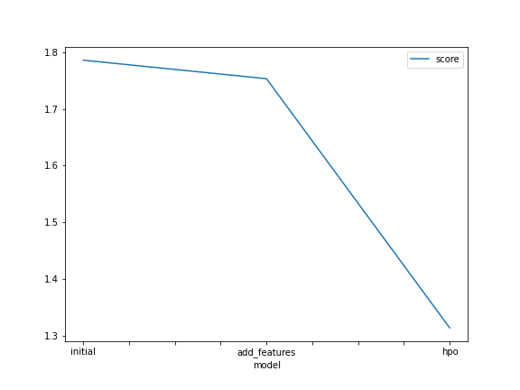
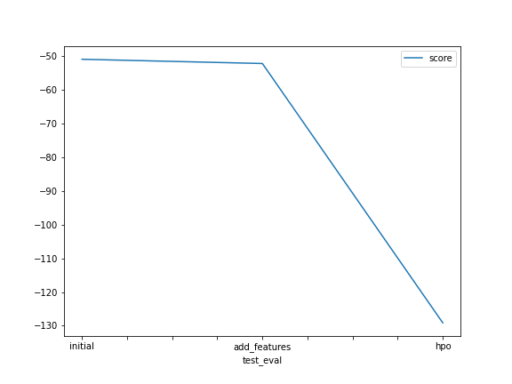

# Report: Predict Bike Sharing Demand with AutoGluon Solution
#### ASIF IQBAL

## Initial Training
### What did you realize when you tried to submit your predictions? What changes were needed to the output of the predictor to submit your results?
Needed to make sure to ignore the columns `casual` and `registered` since those features were not present in `test.csv`

Since I was using my mac the path for my `kaggle.json` needed to be a different location. Also I am sanitizing my api key before submitting it. 

### What was the top ranked model that performed?
WeightedEnsemble_L3 

## Exploratory data analysis and feature creation
### What did the exploratory analysis find and how did you add additional features?
Found some negative values in predictions which needed to be convered to 0 since Kaggle rejects negative values. Did not see any outlier from `train.describe()`. The `min` and `max` were not too far from `mean`. So we have good data
The `datetime` needed to converted as `datetime` format for computer to recognize it correctly, so autogluon can convert that feature into integers as evidenced from the data processed output of `TabularPredictor`. 
### How much better did your model preform after adding additional features and why do you think that is?
By adding year as a feature it can factor in year as a boolean data which made it simple since data was only for 2011 and 2012 as shown in the histogram. So it made it easier to make boolean pattern for the year to predict bike share count by year.

## Hyper parameter tuning
### How much better did your model preform after trying different hyper parameters?
Used smaller learning_rate with larger num_iterations for lightgbm for better accuracy as documented by lightgbm
Used 'reg:squarederror' as the objective for XGB since it is a regression problem. Also lower learning rate gives higher chance to get to best optimum
Used NN_TORCH as it is showing one of the top models and wanted to use num_epochs to something lower since I have CPU and I saw time limit was exceeding for default

### If you were given more time with this dataset, where do you think you would spend more time?
I would try tons of different hyperparameters for few top 3 models, based on autogluon default ranking, and evaluate their performance and pick best combination of hyperparameters for each of those top 3 models.

### Create a table with the models you ran, the hyperparameters modified, and the kaggle score.
|model|NN_TORCH|GBM|XGB|score|
|--|--|--|--|--|
|initial|default|default|default|1.78599|
|add_features|default|default|default|1.75332|
|hpo|'num_epochs': 2, 'activation': 'relu'|'num_boost_round': 200, 'learning_rate': 0.01|'objective': 'reg:squarederror', 'learning_rate': 0.01, 'random_state': 20|1.30460|
### Create a line plot showing the top model score for the three (or more) training runs during the project.

### Create a line plot showing the top kaggle score for the three (or more) prediction submissions during the project.

## Summary
With autogluon it is much easier to stay with default unless you spend a tons of type with hyperparameter tuning to get the best accuracy score. Also it help with autogluon to automatically recognize the type of model is needed based on target value, like it 
realized it is a regression problem based on mutiple integer values in label column. Also I am pretty impressed how it decided to almost hot encoded the datetime and converted the day, month, year into integers.
